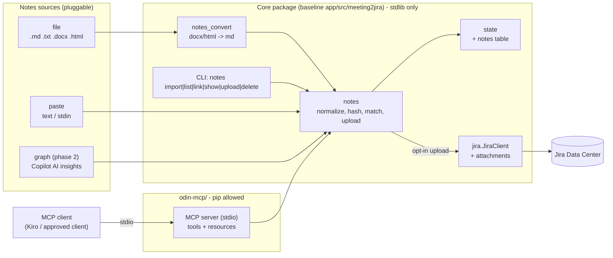

# Design: Odin MCP server and Copilot meeting notes

Read the "Read this first" section of `requirements.md` before this file. Names tagged
**(baseline)** come from the public meeting2jira repo at `5bd4c89`. Task 0 updates them to match the
on-prem Odin code.

## Overview



The design follows the same rule as the rest of Odin: **all logic lives in the stdlib core, and every
entry point is thin.** The MCP server and the CLI both call one service (`notes.NotesService`).
Nothing about notes is decided in the MCP layer, the same way `meeting2jira.cmd` makes no decisions.

## Components

### Core package (stdlib only)

Module names follow the baseline's flat layout. On-prem may differ (task 0).

| Module | New or changed | Responsibility |
|---|---|---|
| `notes.py` | new | `NotesRecord` dataclass, `normalize_markdown()`, `notes_hash()`, `NotesService` (import, match, link, list, get, delete, upload, upload_pending). The only place notes decisions are made. |
| `notes_sources.py` | new | `NotesSource` protocol plus `FileSource` and `PasteSource`. Phase 2 adds `GraphCopilotSource`. Sources produce `NotesRecord`s and nothing else. |
| `notes_convert.py` | new | `.docx` (via `zipfile` + `xml.etree`) and `.html` (via `html.parser`) to Markdown. Headings, lists, bold/italic, links and tables; anything else becomes plain text. |
| `state.py` | changed | `notes` table and indexes created on open. Methods: `add_notes`, `find_notes_by_hash`, `link_notes`, `notes_for_meeting`, `unmatched_notes`, `get_notes`, `delete_notes`, `mark_uploaded`, `note_upload_attempt`, `pending_uploads`, `meetings_near(start_utc, tolerance)`. |
| `jira.py` | changed | `add_attachment(key, filename, data) -> {id, filename, size}` and `list_attachments(key)`. Transport refactor so `request()` can send a non-JSON body (below). |
| `config.py` | changed | `notes` section in `DEFAULTS` and validation in `validate()`. |
| `__main__.py` | changed | `notes` subcommand group. The daily `push` calls `NotesService.upload_pending()` when `notes.upload_to_jira` is true. |
| `sync.py` | unchanged | Notes never affect sub-task creation. |

### `odin-mcp/` (pip allowed)

```
odin-mcp/
  README.md            what it is, how to register it with a client, security notes
  requirements.txt     mcp (pinned); nothing else unless justified
  odin-mcp.cmd         launcher: finds Python and the core app (same discovery as playwright-app,
                       and the parity test keeps the copies identical)
  odin_mcp/
    __main__.py        `python -m odin_mcp`: starts the stdio server
    server.py          tool and resource registration; maps errors to MCP error results
    core.py            locates and imports the core package (M2J_APP_DIR / ../app), loads config,
                       opens State per call, builds JiraClient from the stored token on demand
  tests/
    test_server.py     spawns the server over stdio, calls every tool against a temp data dir
                       and a local mock Jira
```

- **Python version.** The MCP Python SDK needs a newer Python than the core app's 3.8 floor (3.10+
  at the time of writing; check the pinned version). Task 0 confirms the workstation's Python. If
  it's too old for the SDK, see the open questions.
- **Locating the core.** Same contract as `playwright-app/` **(baseline)**: `M2J_APP_DIR`, or
  `../app` by default. It puts `<app>/src` on `sys.path` and imports the package. It never copies
  the core's code.
- **State access.** Open `State` per tool call and close it straight away. The scheduled daily run
  may hold the DB at the same time, and the existing lock timeout covers that.
- **Token.** Read through the core's credential store, only when a tool needs Jira. It never
  appears in results or logs.

## Data model

Additive: a new table, created with `CREATE TABLE IF NOT EXISTS` in `State.__init__`. The `synced`
table is not touched **(baseline: `_SCHEMA` / `_MIGRATIONS` pattern)**.

```sql
CREATE TABLE IF NOT EXISTS notes (
    id                  INTEGER PRIMARY KEY AUTOINCREMENT,
    content_hash        TEXT NOT NULL UNIQUE,   -- sha256 of normalized markdown; import dedupe
    markdown            TEXT NOT NULL,          -- or DPAPI ciphertext, see open question 1
    source              TEXT NOT NULL,          -- file | paste | graph
    source_ref          TEXT,                   -- file name (not full path) or Graph insight id
    title               TEXT,                   -- from the notes, if present
    meeting_start_utc   TEXT,                   -- from the notes, if present (ISO UTC)
    online_meeting_id   TEXT,                   -- phase 2
    imported_at         TEXT NOT NULL,
    meeting_key         TEXT,                   -- synced.key; NULL = unmatched (no FK: survives forget)
    link_method         TEXT,                   -- explicit | auto
    uploaded_issue_key  TEXT,                   -- issue the attachment went to
    attachment_id       TEXT,
    attachment_name     TEXT,
    uploaded_hash       TEXT,                   -- content_hash at upload time
    uploaded_at         TEXT,
    upload_attempts     INTEGER NOT NULL DEFAULT 0
);
CREATE INDEX IF NOT EXISTS ix_notes_meeting ON notes(meeting_key);
CREATE INDEX IF NOT EXISTS ix_notes_start ON notes(meeting_start_utc);
```

- **No foreign key to `synced`.** `forget` deletes `synced` rows **(baseline)**. Notes must survive
  that and become unmatched (Req 3.4). Lookups treat a `meeting_key` with no `synced` row as unmatched.
- **`source_ref` stores the file name, not the full path.** That keeps user directory structure out
  of the DB.
- Notes are versioned by content: a re-generated recap is a new row with a new hash, linked to the
  same meeting (Req 4.6).

## Matching (Req 4)

```
match(record, explicit=None):
    if explicit:                        # meeting key or Jira issue key
        row = synced by key, else synced by issue_key
        return LINK(row, "explicit") if row else ERROR("no synced meeting <x>; run list_meetings")
    if record.meeting_start_utc is None:
        return UNMATCHED(candidates=[])                          # title alone is never enough
    near = state.meetings_near(record.meeting_start_utc, tolerance)
    titled = [m for m in near if title_matches(record.title, m.summary)]
    return LINK(titled[0], "auto") if len(titled) == 1 else UNMATCHED(candidates=near)
```

- `title_matches`: casefold, collapse whitespace, strip punctuation. Match if either string
  contains the other. It compares against `synced.summary`, which is the *rendered Jira summary*
  **(baseline: no raw subject is stored)**, so a summary template such as `Meeting: {subject}`
  still matches by containment. If on-prem stores the raw subject, match on that instead (task 0).
- Notes headers: parse the title and start time from the formats task 0 finds in the real Copilot
  output (e.g. a first `# Title` line and a date/time line). Keep the parser in one function, with
  fixture tests for each format seen. If parsing fails, the notes are stored unmatched, never lost.
- Times in notes are local wall-clock time with no zone. Interpret them in the machine's local
  zone, the same way the rest of Odin treats wall-clock time (no tz database needed).

## Upload (Req 5)

**Transport.** Jira DC attachments: `POST /rest/api/2/issue/{key}/attachments`, as
`multipart/form-data` with a single part named `file`, and the header `X-Atlassian-Token: no-check`.
The response is a JSON list of attachment objects.

The baseline `request()` hard-codes a JSON `Content-Type` and JSON encoding **(baseline)**. Refactor
it into `_send(method, path, data: bytes, content_type)`, which keeps the retries, error hints and
the ambiguity flag. `request()` becomes a JSON wrapper over it, and `add_attachment()` builds the
multipart body with stdlib only (`uuid4` boundary, CRLF framing, `filename*=UTF-8''...` for
non-ASCII names). POST is an unsafe method, so the existing unsafe-method retry rules apply
unchanged.

**Flow** (`NotesService.upload(notes_id, dry_run)`):

1. Load the notes and their link. If unlinked, return an error saying how to link (Req 5.3).
2. Resolve the issue key from `synced`. If `uploaded_hash == content_hash` and
   `uploaded_issue_key == issue`, return "already uploaded" (Req 5.5).
3. Render the name from `attachment_name_template`. Fields: `{date}` (meeting date), `{slug}` (the
   title, ASCII-folded, `[a-z0-9-]`, max 50 characters), `{issue}`. If a prior upload of different
   content went to the same issue, append `-v{n}` (Req 5.7).
4. If `dry_run`, return the issue, name, byte size and first 10 lines, and stop.
5. If `upload_attempts >= max_upload_attempts`, refuse and point to the last error.
6. Call `add_attachment`. On success, `mark_uploaded`.
   - On an **ambiguous** `JiraError`: `list_attachments(issue)`. If an attachment with the same
     name and byte size exists, record it as uploaded. Otherwise count the attempt and report
     (Req 5.6).
   - On a **definite** error (403, 404, 413, attachments disabled): count the attempt and return
     Jira's reason plus the matching hint (Req 5.8).

**Daily run** (Req 5.9). After the existing push, and only if `notes.upload_to_jira` is true:
`upload_pending(limit=max_uploads_per_run)` over linked notes where `uploaded_hash` is null or
stale. Upload failures go into the run summary as per-item errors (exit code 1), never as a crash,
and they never affect sub-task creation.

## MCP surface (Req 6)

| Tool | Arguments | Returns | Annotations |
|---|---|---|---|
| `list_meetings` | `days_back=14`, `only_without_notes=false`, `limit=50` | meeting key, issue key, summary, start, notes count | read-only |
| `import_notes` | `path` or `text` (exactly one), `meeting` (optional key/issue), `title`, `start` (optional overrides) | notes id, status `linked`/`unmatched`/`duplicate`, candidates | not read-only, not destructive, idempotent |
| `list_unmatched_notes` | `limit=20` | notes id, title, start, candidates | read-only |
| `link_notes` | `notes_id`, `meeting`, `confirm=false` | the link; asks for `confirm=true` when re-linking uploaded notes | not read-only, idempotent |
| `get_notes` | `notes_id` | markdown and metadata | read-only |
| `upload_notes` | `notes_id`, `dry_run=true` | the plan, or the attachment id | not read-only, open-world |
| `delete_notes` | `notes_id`, `confirm=false` | deleted or "confirm required" | destructive |
| `fetch_copilot_notes` | `days_back=1` (phase 2) | per-meeting import results | not read-only, open-world |

- **Resources:** `odin://meetings/{meeting_key}/notes` (newest notes as Markdown) and
  `odin://notes/{id}`.
- **`path` arguments** are resolved and must be regular files under the user's profile (or
  `notes.import_dir` if set). This stops a prompt-injected path from reading arbitrary files.
- **Tool descriptions** say plainly that `upload_notes` sends data to Jira and that dry-run comes
  first. Notes text returned by `get_notes` is the user's data, and the server never interprets it
  as instructions.

## Phase 2: Graph Copilot source (outline only; blocked on IT)

- **Endpoint.** The Microsoft 365 Copilot meeting AI-insights API:
  `GET /copilot/users/{id}/onlineMeetings/{onlineMeetingId}/aiInsights`, then each insight's meeting
  notes and action items, rendered to Markdown.
  - It needs the delegated permission `OnlineMeetingAiInsight.Read.All` and a Copilot license.
  - **Check before committing:** v1.0 vs beta status, and availability in the user's cloud
    (GCC / GCC High / DoD use different hosts; see HANDOFF P2-C).
- **Meeting id.** It comes from the calendar event's join URL
  (`/me/onlineMeetings?$filter=JoinWebUrl eq '...'`).
  - **Contract impact:** the COM exporter doesn't currently export a join URL **(baseline)**. Adding
    it is an optional schema-v1 field (backward compatible), and must not read the item `Body`
    (non-negotiable 6). If the join URL is only reachable through the body, use the Graph calendar
    instead.
- **Auth.** Public-client device-code flow over `urllib`, with the refresh token stored via DPAPI.
  It shares this design with HANDOFF P2-C (Graph calendar source), so build both together if they
  land together.

## Error handling

| Situation | Behavior |
|---|---|
| Unsupported file type, empty, too large | Refuse before storing; the message names the limit or formats |
| Duplicate content | Return the existing notes id, status `duplicate` |
| No time in notes / ambiguous match | Store unmatched, return candidates |
| Explicit meeting not found | Error naming `list_meetings` |
| Upload while unlinked | Error naming `link_notes` |
| Jira 403/404/413 or attachments disabled | Count the attempt, return Jira's reason plus a hint; stop after `max_upload_attempts` |
| Ambiguous upload | Check attachments by name and size before counting it as failed |
| DB locked by the scheduled run | Existing lock timeout, then a clear "try again" error |
| Core app not found by `odin-mcp` | Error naming `M2J_APP_DIR` |

## Testing strategy

- **Core** (`unittest`, ships with the app):
  - `test_notes.py`: normalize/hash, the matching table (0/1/2 candidates, title-only refused,
    tolerance edges), link/re-link/confirm, delete, the forget-leaves-notes-unmatched case.
  - `test_notes_convert.py`: fixture `.docx` and `.html` files, BOM and cp1252 text.
  - `test_jira_client.py` additions: the mock server parses multipart and asserts
    `X-Atlassian-Token`. Covers success, 413, an ambiguous 502 followed by an existing attachment,
    and duplicate suppression.
  - `test_state.py` addition: open a pre-feature DB, and check the `notes` table is added with no
    `synced` rows lost.
  - Guardrails: extend `test_stdlib_only` to the new modules automatically (it globs the package),
    and add a guardrail that no core module imports `mcp`.
- **`odin-mcp/tests`** (pytest is fine here; it doesn't ship with the core):
  - Spawn the server, `list_tools`, and assert the annotations.
  - Exercise every tool against a temp data dir and a mock Jira.
  - Assert no tool output contains the token.
  - Assert `path` arguments outside the allowed roots are refused.
- **Target-machine verification** (to the HANDOFF checklist): real Copilot export formats, the
  workstation's MCP client and its Python, Jira attachment size limit and permissions, and (phase 2)
  Graph availability in the tenant's cloud.

## Open questions (resolve in task 0 with the user)

1. **Encryption at rest.** Store notes as plain text in `state.db`, like other state, or
   DPAPI-encrypt the `markdown` column? Notes are far more sensitive than meeting titles, and may
   contain CUI. DPAPI needs no new dependency (`credstore.py` already wraps it **(baseline)**) but
   makes the DB unreadable off-machine, which is probably desirable. Recommendation: encrypt.
2. **MCP client on the workstation.** Which approved client will run the server (Kiro, VS Code with
   Copilot agent mode, another)? This decides the registration instructions, and whether MCP is
   even permitted by policy there.
3. **Python for `odin-mcp/`.** If the workstation's Python is older than the SDK supports, choose
   between installing a newer per-user Python, or a minimal stdlib JSON-RPC stdio implementation
   inside `odin-mcp/` (same tools, no SDK).
4. **Copilot export formats in this tenant.** Which can the user actually get: copy as rich text
   (pastes as HTML or plain text), a downloaded `.docx`, a Loop component? This decides which
   converters are phase 1 and which header formats the parser must read.
5. **Overlap with on-prem features.** Does Odin on-prem already store anything per meeting (notes,
   transcripts, attachments) or already have an MCP server? If so, extend it rather than adding the
   `notes` table or `odin-mcp/`.
