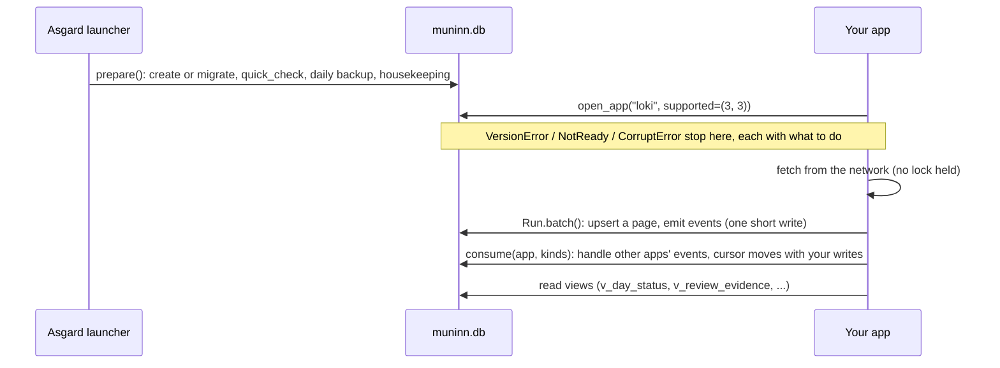
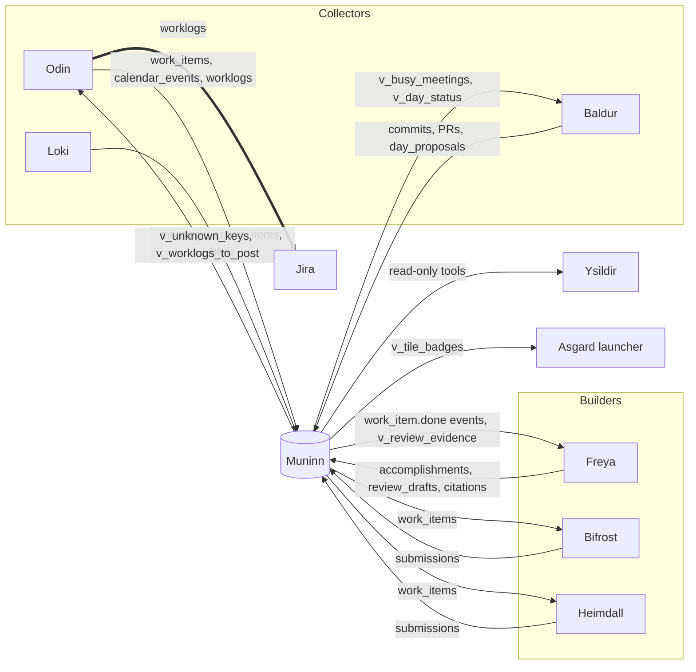

# Integrating an app with Muninn

Oct 9, 2026 · schema v3 · Asgard 0.4.0 (unshipped)

Muninn is one SQLite file per user (`%LOCALAPPDATA%\Asgard\muninn.db`) that every Asgard app shares. Apps never call each other: each writes the facts it owns and reads what the others wrote. This folder is the contract for doing that. Start here, then read your app's page.

| Page | App | Status |
| --- | --- | --- |
| [odin.md](odin.md) | Odin: Jira issues, calendar, worklogs; the only Jira writer | Package ready; Odin's move is in progress elsewhere |
| [baldur.md](baldur.md) | Baldur: git, GitHub, time estimates and approvals | Integrated |
| [freya.md](freya.md) | Freya: accomplishments and review drafts | Spec |
| [loki.md](loki.md) | Loki: meeting recaps, action items, BLUFs | Spec |
| [heimdall.md](heimdall.md) | Heimdall: SeCcHm submissions | Diverging on-prem; contract only |
| [bifrost.md](bifrost.md) | Bifrost: BEARs workbooks and Confluence uploads | Spec |
| [ysildir.md](ysildir.md) | Ysildir: MCP server over Muninn, read-only first | Spec |
| [valkyrie.md](valkyrie.md) | Valkyrie and Valhalla: install and uninstall | Spec |
| [huginn.md](huginn.md) | Huginn: scheduled collection | Spec |
| [mimir.md](mimir.md) | Mímir: the one AI switch; writes nothing itself | Spec |

The schema is `asgard/muninn/migrations/` (the header of `0001_initial.sql` lists every owner), and the table-by-table reference is [../muninn-design.md](../muninn-design.md). Running the file by hand is [../muninn-operations.md](../muninn-operations.md).

## The contract

Each rule is enforced in code or in the schema; the last column says where, so nobody has to remember it.

| # | Rule | Enforced by |
| --- | --- | --- |
| 1 | Only Asgard creates and migrates Muninn (`muninn.prepare()` at launcher start). Apps open it with `muninn.open_app(app, supported=(low, high))`, which never changes the schema. | `open_app` has no migrate path; the guard refuses DDL and `PRAGMA user_version` |
| 2 | An app writes only the tables it owns, plus the shared operations every app needs, and in shared tables only its own rows: its events, runs and event cursor, the sources it reads (a source belongs to the first app that runs a stream on it), and the identity kinds it collects (`guard.IDENTITY_KINDS`). | `guard.py`: an SQLite authorizer and per-connection row rules on every `open_app` connection |
| 3 | Write through `asgard.muninn` (`Run`, `transaction`, `emit`, the per-app modules), never by holding a lock across a network call, a git call or a UI wait. | `transaction()` refuses to nest; `Run` writes in short batches |
| 4 | Every fact carries provenance: `source_id`, its ID in that system, `first_seen_at`/`last_seen_at`, `run_id`. | Schema (NOT NULL, UNIQUE natural keys) |
| 5 | Upserts are idempotent (`INSERT … ON CONFLICT DO UPDATE`). Nothing synced is deleted; it gets `deleted_at`, and only a `mode="full"` run may set it. | `sweep_calendar` refuses incremental runs; a test bans `INSERT OR REPLACE` |
| 6 | Jira issues outside Odin are stored as a key (`PROJ-123`), never Odin's row id. Keys are upper case. | v3 triggers on every cross-app key column; `muninn.normalize_key()` |
| 7 | Every meaningful change appends one event, in the same transaction as the change. Events are never edited. | `events_no_update` / `events_no_delete` triggers; `emit` inside the writer's transaction |
| 8 | Anything that leaves Asgard (a worklog, a BLUF, a submission) needs a person's approval first, and only Odin writes to Jira. | CHECKs on approved/posted states; v3 `worklogs_need_an_approval` |
| 9 | No secrets in Muninn; summaries and links, not transcripts or descriptions. | `redact.py` at the writer boundary (a net, not a vault) |
| 10 | Times are UTC text `YYYY-MM-DDTHH:MM:SSZ`; a day is a `local_date` in the Windows time zone. | CHECK on every timestamp column; `muninn.to_ts()` |

## An app's life with Muninn



1. **Open.** `con = muninn.open_app("<app>", supported=(low, high))`. `supported` has no default on purpose: it is the range of schema versions your code was written and tested against. A screen that only reads can pass `readonly=True`.
2. **Collect.** Wrap each sync in `muninn.Run(con, app, source_id, stream, mode=...)`. Fetch with no transaction open; write each page in `run.batch()`.
3. **Decide.** A person's decision (approve, reject, mark final) is one `muninn.transaction(con)` that changes the row and emits its event together.
4. **React.** Read other apps' events with `muninn.consume()`; the writes you make inside the block commit with your cursor.
5. **Read.** Prefer the views: they are the contracts between apps, and their rules live in SQL so every reader agrees.
6. **Close.** `con.close()`. Connections are cheap; open one per thread.

## Write recipes

### A collector

```python
src = muninn.ensure_source(con, "teams", "graph")        # a password or token in a URL is dropped
with muninn.Run(con, "loki", src, "recaps", mode="incremental") as run:
    for page in client.recaps(since=run.cursor):         # no lock held while fetching
        with run.batch():                                # one short write; each item all or nothing
            for item in page:
                try:
                    loki.upsert_recap(run, item)         # your module: upsert, run.saw(...), run.emit(...)
                except ValueError as exc:
                    run.problem(f"{item['id']}: {exc}")  # run ends 'partial'; cursor stays for a retry
        run.advance_cursor(page.newest_updated)
```

The cursor is saved only when the run ends without an exception and without problems. A crash or a problem means the next run re-reads the same items, and the upserts take them without writing twice.

### A decision

```python
with muninn.transaction(con):
    con.execute("UPDATE blufs SET state = 'approved', approved_at = ? WHERE id = ? AND state = 'draft'",
                (muninn.utcnow(), bluf_id))
    muninn.emit(con, "loki", "bluf.approved", "blufs", bluf_id, ref=subject_ref)
```

Put each app's decisions in `asgard/muninn/<app>.py` beside the schema, as `muninn.baldur` does, so every caller (the app's window, its CLI, Ysildir) follows one set of rules.

### Something that leaves Asgard

Anything sent to another system (Jira, Confluence, SeCcHm, mail) follows Odin's posting protocol, because a timeout leaves you not knowing whether it arrived:

1. In one transaction, write the outgoing row in a `sending` state with a random marker that will travel with the payload (`[asgard:b-9f3c1a2b]` in a worklog comment).
2. Commit, then make the network call with no lock held.
3. A definite answer settles it: success records the remote id; a definite refusal (4xx) marks it failed so it can be offered again.
4. A timeout leaves it `sending`. Nothing else is sent for the same thing while one is in doubt. Later, search the remote system for the marker: found means sent; only a search that ran and didn't find it may mark it failed (`resolve_stuck(..., searched=True)`).

Never delete the outgoing row once it may have arrived; it is what stops a second send (v3 enforces this for worklogs).

### Reacting to another app's events

```python
with muninn.consume(con, "freya", ["work_item.done", "work_item.reopened"]) as batch:
    for event in batch:
        freya.record_finish(con, event)          # commits with the cursor, or not at all
if batch.truncated:
    ...                                          # more waiting; call again
```

One trap: **an app has one event cursor, not one per kind list.** `consume()` moves the cursor past events of kinds you didn't ask for, so call it once with every kind the app handles. Two calls with different kind lists lose events.

## Errors an app must handle

| Exception | Means | What the app shows |
| --- | --- | --- |
| `NotReady` | Muninn hasn't been created | "Open Asgard once, then start <app> again" (the message says this) |
| `VersionError` | Schema outside your `supported` range | Its message: open Asgard to upgrade, or update the app |
| `CorruptError` | The file failed its check | Its message, which names the newest backup and the restore command |
| `BusyError` | Another app held the write lock for 30 s | "Nothing was lost; try again." Retry the whole action later |
| `MuninnError` | Any rule broken in a way the person can fix | The message as is |
| `sqlite3.IntegrityError` | A schema rule refused a write (a bad key, a decided proposal) | A bug in the app: log it, show the message |
| `sqlite3.DatabaseError: not authorized` | The guard refused a write to a table you don't own | A bug: `muninn.guard.describe(exc)` says which table and why |

Command-line apps exit 2 for these (1 is for "ran, found problems"), matching `Asgard.pyw --muninn`.

## Asking for a new table or column

Only Asgard migrates, so a new app's tables arrive in a migration:

1. Add `asgard/muninn/migrations/000N_<what>.sql`: STRICT tables, the conventions in the design doc, triggers for search if the text should be findable. Never edit a shipped migration.
2. Add the tables to `guard.OWNERS` (a test fails until every table has an owner).
3. Add checks to `tools/check_muninn_schema.py` and tests to `tests/test_muninn*.py`.
4. Bump every app whose `supported` range should include the new version, after running its tests against it.
5. Update the design doc and your app's page here.

Additive changes (a table, a nullable column, an index, a view) don't break older apps, so widening their `supported` ranges is a test run, not a code change.

## Testing an integration

- Point `ASGARD_HOME` at a temporary folder, call `muninn.prepare(path)`, then open your connection with `open_app` exactly as the app does, so the guard is in the test.
- Assert behaviour through the views other apps read, not your own tables alone.
- End each scenario with `muninn.integrity.check(con)` and assert it has no findings: it catches search drift, double posts, malformed keys and cursors past the log.
- No network: use the fakes in `tests/` (`fake_github.py`, `fake_servicenow.py`) or add one.

## How the apps interact



The three flows that cross apps today, end to end:

| Flow | Steps |
| --- | --- |
| A key from a branch name | Baldur stores `commit_work_items(PROJ-12)` → `v_unknown_keys` lists it → Odin looks it up and writes `work_item_aliases` (current, moved, not_found) |
| Approved time to Jira | Baldur `approve()` + `day_proposal.approved` → `v_worklogs_to_post` → Odin `begin_post` (sending + marker) → Jira → `finish_post` + `worklog.posted` → `v_day_status` shows it logged |
| A finished issue to Freya | Odin sync sees done → `work_item.done` → Freya `consume()` → `accomplishments` |

## Event catalog

Kinds are `noun.verb`, lower case. Emit inside the transaction that made the change. Planned kinds are the contract for apps not built yet; change them here first.

| Kind | Emitted by | Payload | Acted on by |
| --- | --- | --- | --- |
| `work_item.created`, `.updated` | Odin | status and summary; changed fields as [old, new] | Ysildir (what changed) |
| `work_item.moved` | Odin | `from`, `to` | Baldur relabels its review screen |
| `work_item.done`, `.reopened` | Odin | resolution, resolved_at / status | Freya |
| `work_item.deleted` | Odin | — | Freya marks the accomplishment's source gone; Baldur's unpostable view |
| `worklog.posted`, `.failed` | Odin | origin, seconds, proposal_id, calendar_event_id; error | Baldur (status beside the day) |
| `day_proposal.approved` | Baldur | local_date, minutes | Odin posts on its next run |
| `estimate_run.created` | Baldur | date range, counts | Ysildir |
| `meeting.recapped`, `action_item.created`, `bluf.drafted`, `.approved`, `.posted` | Loki (planned) | external ids, subject_ref | Freya (decisions as evidence), Ysildir |
| `accomplishment.recorded`, `review_draft.created`, `.final` | Freya (planned) | jira_id, period | Ysildir |
| `submission.created`, `.approved`, `.submitted`, `.status_changed` | Heimdall, Bifrost (planned) | system, external_id, from/to state | Ysildir; tile badges |
