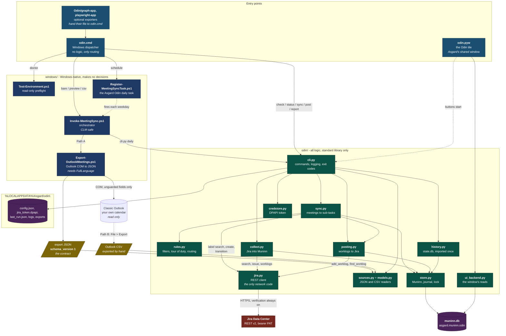
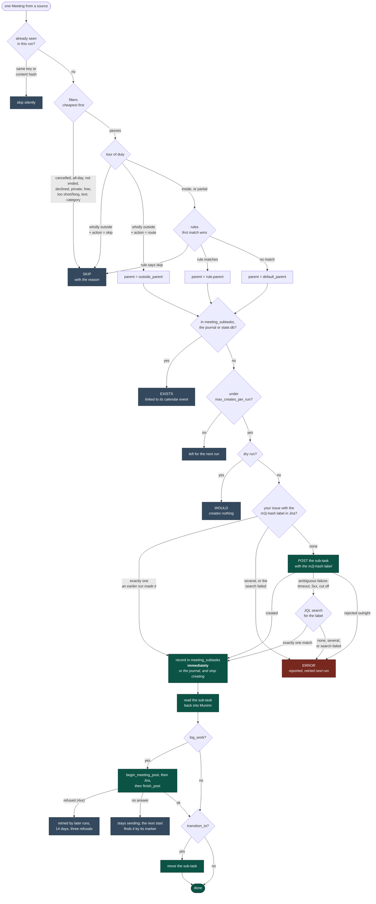

# Architecture

How Odin's files fit together. Odin's code is in [`Asgard/apps/odin`](../Asgard/apps/odin) since Oct 10, 2026; its contract with Muninn, the order of the daily run and what protects Jira are in [Asgard/docs/integration/odin.md](../Asgard/docs/integration/odin.md). For *why* it is split this way, see the [README design notes](README.md#design-notes); for setup, [INSTALL.md](INSTALL.md).

The shape of it in one line: **thin PowerShell reads Windows, standard-library Python makes every decision, the two meet at a versioned JSON contract, and Muninn holds every record.**

Paths below are relative to `Asgard/apps/odin/` unless they say otherwise.

## File interaction

Reading it:

- **Nothing in `windows/` decides anything.** The exporter dumps what is on the calendar; Python filters, routes and dedupes. The testable logic stays in one place.
- **`sources.py` is the only thing that knows which path produced a meeting.** Everything downstream sees `Meeting` objects, so a new calendar source (Graph, OWA) changes nothing in `rules`, `sync` or `jira`.
- **`jira.py` is the only module that touches the network**, `credstore.py` the only one that touches the secret, and `store.py` the only one that writes Muninn (through `asgard.muninn.odin`, under Muninn's guard).
- **The window only reads.** Its buttons start the same `cli.py` commands the scheduled task runs, so there is one code path to Jira.

## What happens to one meeting

The things that keep repeated runs safe:

1. **The record is written the instant Jira accepts the create**, before the worklog and the transition, so a failure in either can never produce a duplicate sub-task. If Muninn can't take it, it goes to `unrecorded.jsonl` and the run stops creating.
2. **Jira is asked before every create.** A sub-task an earlier run made but couldn't record (an answer lost or cut off, a run stopped halfway, a full disk) carries the meeting's deterministic `m2j-<hash>` label, so the next run finds it instead of making it again; an ambiguous create is looked up at once. Several matches, or a search that fails, are reported for a person and nothing is created.
3. **Every worklog goes through a `sending` row with a marker**, committed before the call, so time is never logged twice; a lost answer is settled by searching for the marker.

Because of those, the scan window is not a correctness mechanism: widening `-DaysBack` is always safe.

## Supporting files

| Path | Role |
|---|---|
| `tools/Test-PowerShellSyntax.ps1` | Parses every `.ps1` and rejects PowerShell 7-only syntax. Real under 5.1. |
| `tools/Invoke-WindowsChecks.ps1` | The Windows-only checks (`odin selftest`): 5.1 parsing, DPAPI, the PowerShell-to-Python handoff, the CSV push, the entry point, `Test-Environment.ps1` at runtime, and the task start time. Safe on the real workstation. |
| `Asgard/tests/test_odin_*.py` | `unittest`, offline, against a temporary Muninn and `tests/fake_jira.py`. `test_odin_guardrails.py` enforces the non-negotiables: TLS is never disabled, no execution-policy bypass, no guarded Outlook properties, CLM-safe ASCII scripts, and every exporter package documented in `MODULES.md`. `test_dependencies.py` keeps the daily run on the standard library. |
| `.github/workflows/odin-checks.yml` (repo root) | The Odin tests, the exporters' tests and the PowerShell checks, on Linux and on a Windows runner. |
| `infra/windows-test-vm/` (repo root) | Terraform for a throwaway Windows Server host to run the Windows checks on, over SSM with no inbound rules. Never shipped. |
| `.kiro/` (repo root) | Kiro steering, subagents and hooks for development. Never shipped. See `KIRO_SETUP.md`. |
