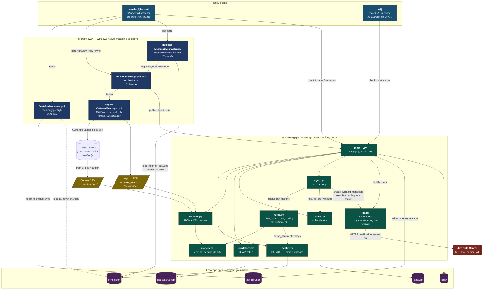
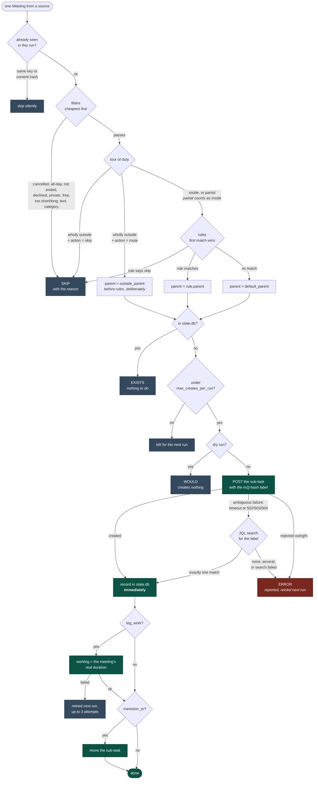

# Architecture

How the files fit together. For *why* it is split this way, see
[README design notes](README.md#design-notes); for setup, see [INSTALL.md](INSTALL.md).

The shape of it in one line: **thin PowerShell reads Windows, standard-library Python makes every
decision, and the two meet at a versioned JSON contract.**

Everything the program needs to run lives in **`Odin/app/`**. Copying that folder to a machine is a
complete install; the rest of `Odin/` is sibling deliverables and docs, and the repo root above it
is development support. Paths in this document are relative to `Odin/`. That holds because every path inside
`app/` is derived from the file's own location rather than the working directory, so the folder can
sit anywhere.

Inside it, **`app/src/`** is the program proper, split into its two halves — `meeting2jira/` (the
Python logic) and `windows/` (the Windows-native layer). `tests/` and `tools/` sit outside `src/`
because they verify the program rather than being part of it. The diagram below is all `app/`
except where noted.

## File interaction

Reading it:

- **Arrows are "calls" or "reads/writes".** Dotted arrows are indirect: the scheduled task fires the
  orchestrator later, and `Test-Environment.ps1` only reports.
- **Nothing in `src/windows/` decides anything.** The exporter dumps what is on the calendar; the
  Python side filters, routes, and dedupes. That keeps the testable logic in one place and means the
  PowerShell only has to be correct about extracting data.
- **`sources.py` is the only thing that knows which path produced a meeting.** Everything downstream
  sees `Meeting` objects, which is why a future Microsoft Graph source changes nothing in
  `rules`/`sync`/`jira`.
- **`jira.py` is the only module that touches the network**, and `credstore.py` is the only one that
  touches the secret.

## What happens to one meeting

The two things that keep repeated runs safe:

1. **State is recorded the instant Jira accepts the create**, before the worklog and transition. A
   failure in either can never produce a duplicate sub-task.
2. **An ambiguous create is never blindly retried.** It may already have succeeded, so the
   deterministic `m2j-<hash>` label is looked up first. Anything less than exactly one match is
   reported for a human rather than guessed at.

Because of those, the scan window is not a correctness mechanism — widening `-DaysBack` is always
safe, which is why there is no deferral queue anywhere in this project.

## Supporting files

| Path | Role |
|---|---|
| `app/tools/Test-PowerShellSyntax.ps1` | Parses every `.ps1` and rejects PowerShell 7-only syntax. Real under 5.1. |
| `app/tools/Invoke-WindowsChecks.ps1` | The Windows-only checks: 5.1 parsing, DPAPI, the PS→Python handoff, the CSV push, the entry point, `Test-Environment.ps1` at runtime, and the task start time. Safe on the real workstation. |
| `app/tests/` | `unittest`, offline. `test_guardrails.py` enforces the non-negotiables: stdlib-only, TLS never disabled, no execution-policy bypass, no guarded Outlook properties, CLM-safe scripts. |
| `infra/windows-test-vm/` | Terraform for a throwaway Windows Server host to run those checks on, over SSM with no inbound rules. Outside `app/`, never shipped; it uploads `app/` alone. |
| `.kiro/steering/` | Project rules loaded automatically by Kiro: product scope, tech constraints, structure, workflow, PowerShell and test specifics. |
| `.kiro/agents/`, `.kiro/hooks/`, `tools/` | Kiro dev tooling: cheaper-model subagents, hooks, and the compact test runner they call. Outside `app/`, never shipped. See `KIRO_SETUP.md`. |
