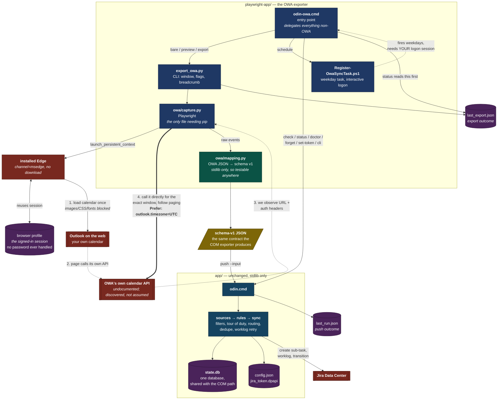

# How the OWA exporter works

For the design of the main tool see [../ARCHITECTURE.md](../ARCHITECTURE.md). This covers only what
is different: getting calendar data out of Outlook on the web instead of out of Outlook over COM.

One sentence: **the browser is used as an authenticated session, not as a screen to scrape.**

## The whole picture

The numbered path is the interesting part. Steps 1–3 happen once per run; step 4 is where the data
actually comes from, and it costs the same whether you ask for one day or thirty.

## Why observe-then-call, rather than scrape

The calendar grid is a virtualised React view. It renders only visible rows, its class names are
generated, and — the part that settles it — **the fields the filters depend on are not in the DOM**:
`responseStatus`, `sensitivity`, `categories`, and recurrence identity. A DOM scraper would silently
lose `skip_declined` and `skip_private`. For a tool whose job includes keeping private meetings out
of Jira, that is not an acceptable trade.

So the page is loaded once purely to watch it authenticate itself and ask its own API for events.
From that one observation we learn the URL and the auth headers, and then we ask the same endpoint
for the window we actually want.

## The four steps in detail

**1. Load the calendar once.** A persistent browser profile means the session from the last
interactive sign-in is reused, so no password is handled by this code and Conditional Access sees a
browser it already trusts. Images, CSS, fonts and media are aborted — the JSON arrives regardless.

**2–3. Observe.** A response listener waits for a request whose URL looks like a calendar read *and*
whose body actually contains events. Three layers decide that, because the page fetches several
things that look like a calendar if you check only one of them:

| Layer | What it stops | The decoy that gets past the others |
|---|---|---|
| **Tiered URL match** | A strong pattern (`calendarView`, `GetCalendarView`, `/me/events`) is accepted the moment its body checks out. A weak pattern (anything merely containing `/events` or `/calendar`) is only a fallback. | `/api/v1.0/me/insights/events` — documents shown around meetings. It has a `subject` and a `dateTime` start, so it passes every shape check. |
| **Shape check** | Requires a `subject`, or a `start` that is date-shaped rather than a bare integer. | `/owa/telemetry/events` and friends — performance records whose `start`/`end` are millisecond offsets. |
| **Weak-candidate ranking** | Among weak candidates, the most calendar-like payload wins, scored on fields only a meeting has (`end`, `showAs`, `responseStatus`, `sensitivity`, `isAllDay`, `recurrence`…). | Arrival order. The decoys are fetched during startup and the calendar last, so keeping the *first* weak hit reliably picks a decoy the day Microsoft renames the endpoint. |

The third layer is the subtle one and it was a real bug: with the endpoint renamed to something the
strong tier no longer matched, first-weak-wins exported the insights list instead of the calendar.
Ranking is used only to choose *between* weak candidates, never to accept or reject one, so an
endpoint that omits some of those fields is still usable.

The wait blocks on the response event rather than polling, and the budget is spent against a
monotonic deadline rather than decremented per wakeup, so a page that answers slowly is still found.
The quiet slice that ends discovery doubles as the grace window in which a better weak candidate can
outrank an early decoy.

**4. Call it directly.** The observed URL's date range is rewritten to our window, `$top` is raised to
reduce round trips, `Prefer: outlook.timezone="UTC"` is set so no timezone conversion is ever needed,
and `@odata.nextLink` is followed to the end. `context.request` shares the browser's cookies, so this
is authenticated without re-handling any credential.

Three bounds keep that loop honest. A transient answer (429, 502, 503, 504, or a dropped connection)
is retried **once** — enough for a blip on an agency proxy, not enough to paper over a real fault. A
`nextLink` pointing at a page already fetched stops paging instead of spinning forever. And
`max_pages` (20) and `max_events` (20,000) cap the run, each saying so on stderr when it fires, so a
truncated export is never silent.

## Prior art, and what it settled

There is no published write-up of doing *this* — network-interception of OWA's calendar API for
timekeeping. What exists is adjacent, and two pieces of it changed the code.

**[roethof.net, "If You Can Read It in OWA, You Can Archive It"](https://roethof.net/posts/2026/03/extract-owa-email-history-playwright/)** (Mar 2026) is the closest
documented precedent: Playwright against OWA with `launch_persistent_context`, same session-reuse
idea. It takes the DOM route, and its shape is the argument against that route. It reads
`div[role="option"]`, `aria-label` and `div.allowTextSelection`, scrolls a virtualised listbox with a
`stuck_patience` counter to guess when the list has ended, and then needs a whole second stage to
reconstruct real timestamps from localized relative labels — mapping `ma`/`di`/`wo` to weekday numbers
and subtracting days from the scan time. For mail that is merely ugly. For worklogs it is
disqualifying: the timestamp *is* the data. It also never recovers `responseStatus` or `sensitivity`,
because those are not in the DOM. (Summarized; content rephrased for licensing compliance.)

**[yusufaltunbicak/outlook-cli](https://github.com/yusufaltunbicak/outlook-cli)** does take the
interception route — Playwright captures the OWA bearer token, then calls the API directly — and it
independently corroborates most of what this module assumed:

| | outlook-cli | here |
|---|---|---|
| Base | `https://outlook.office.com/api/v2.0/me` | discovered, not assumed |
| Path | `/calendarview` | `_CALENDAR_STRONG` matches `calendarview` |
| Params | `startDateTime`, `endDateTime`, `$top` | same three, rewritten by `_with_window` |
| Envelope | `resp.get("value", [])` | `extract_events` tries `value`, `Items`, `items`, `Events` |
| Paging | — | `@odata.nextLink` |
| Timezone | not pinned | `Prefer: outlook.timezone="UTC"` |

**It also found a real bug.** outlook-cli reads `Subject`, `Start.DateTime`, `ShowAs`, `Sensitivity`
and `ResponseStatus.Response` — **PascalCase**. `mapping.py` was camelCase-only. Microsoft documents
the split in [Compare Microsoft Graph and Outlook endpoints](https://learn.microsoft.com/en-us/outlook/rest/compare-graph):
Graph uses camelCase, the Outlook endpoint uses PascalCase, and converting between them is just a
case change. Since this exporter *discovers* its endpoint rather than choosing it, it can be handed
either. Field lookup is now case-insensitive (`mapping._field`), and `PropertyCasingTests` asserts the
same fixture in both casings maps to identical output.

The dangerous version of that bug was not the total failure — a missing `start` skips the event
loudly. It was the partial one: `subject` and `start` mapping while `Sensitivity` and `ResponseStatus`
did not, which pushes private and declined meetings to Jira and reports success.

**Caveat on the base URL.** `outlook.office.com/api/v2.0` is the public *Outlook REST API v2.0*, which
Microsoft [deprecated in 2020 and began decommissioning on 31 March 2024](https://devblogs.microsoft.com/microsoft365dev/final-reminder-outlook-rest-api-v2-0-and-beta-endpoints-decommissioning/),
with a carve-out for Outlook add-ins. So it is corroboration of the *shape*, not evidence that OWA's
own client still calls that host. Whatever OWA actually uses is what discovery will find, which is
precisely why the endpoint is observed rather than hard-coded — and why `odin-owa discover`
on the target machine is still a required step.

## Performance, in the order it matters

| | |
|---|---|
| **Session reuse** | Removes interactive sign-in, the only genuinely slow step, and all MFA prompts. |
| **Installed Edge** | `channel="msedge"`, so no ~150MB browser download and no unsigned binary introduced. Falls back to bundled Chromium. |
| **Resource blocking** | Images, media, fonts, stylesheets aborted. Off during `--login`, or the sign-in page renders unstyled for the human. |
| **One render, then direct calls** | A 30-day export costs the same page load as a 1-day export. |
| **Event-driven waiting** | Blocks on the response event instead of polling, and slices the wait so a sign-in redirect is noticed promptly rather than after the full timeout. |
| **Telemetry hosts aborted** | Beacon traffic is refused at the route handler, so nothing is sent to endpoints the export does not need. |
| **Discovery page closed** | The discovery page is closed in a `finally`, releasing its renderer process rather than holding it for the rest of the run. |
| **Headless** | Once a session exists. |

Measured against the fake OWA server on a warm cache: ~505ms end to end — 266ms to start Playwright,
121ms to launch the browser, 101ms to discover the endpoint, 9ms to fetch the window. The only asset
that loads is the script, because it is what fires the calendar request.

## What it inherits for free

Because the output is schema-v1 JSON and the pipeline is untouched, every correctness property
already paid for still applies: filters, tour of duty, routing rules, the per-run cap, ambiguous-create
recovery, bounded worklog retry, and private-subject withholding.

**One state database, shared.** `content_hash` is source-independent — normalised subject, start, end —
and `state.find()` matches on key *or* content hash. So a meeting already pushed via COM is recognised
here as `EXISTS`. Running both paths cannot double-create.

**Better Teams detection than COM.** `isOnlineMeeting` plus `onlineMeetingProvider` are explicit,
where the COM exporter has to match on the location string.

## Where it is fragile, and what that looks like

| Failure | How it surfaces | What to do |
|---|---|---|
| Browser session expired | Export fails; `_looks_like_sign_in` catches the redirect | `odin-owa login` |
| Microsoft changed the endpoint | "never saw a request returning events" | `odin-owa discover`, then `--endpoint` |
| Endpoint is a POST (`service.svc` shape) | Reported explicitly, then falls back to the events discovery already captured | Window is whatever the view showed; check `discover` for a GET-shaped endpoint |
| Endpoint ignored the UTC preference | `mapping.py` **refuses** rather than guessing an offset | Nothing silently shifts; fix the Prefer header |
| Playwright missing or broken | Recorded in `last_export.json` | `odin-owa setup` |

That fourth row is deliberate. Guessing a timezone offset would shift every meeting and look
plausible; Windows has no timezone database without the `tzdata` package, so the mapping refuses a
naive non-UTC time instead of converting it.

## The silent-failure hole this closes

The push writes `last_run.json`. But if the **export** fails, the push never runs, so `last_run.json`
keeps yesterday's success and `status` looks healthy while meetings quietly stop arriving — for days,
until the staleness warning notices.

So `export_owa.py` always writes `last_export.json`, on every path including "Playwright isn't
installed", and `odin-owa status` prints it *before* delegating to the main app's status.

## This is the fallback, not the destination

It depends on an undocumented Microsoft API that can change without notice. That is the price of not
having an app registration. If a Graph app registration ever comes through — public client, delegated
`Calendars.Read` — prefer it and retire this: same JSON contract, supported API, no browser.
