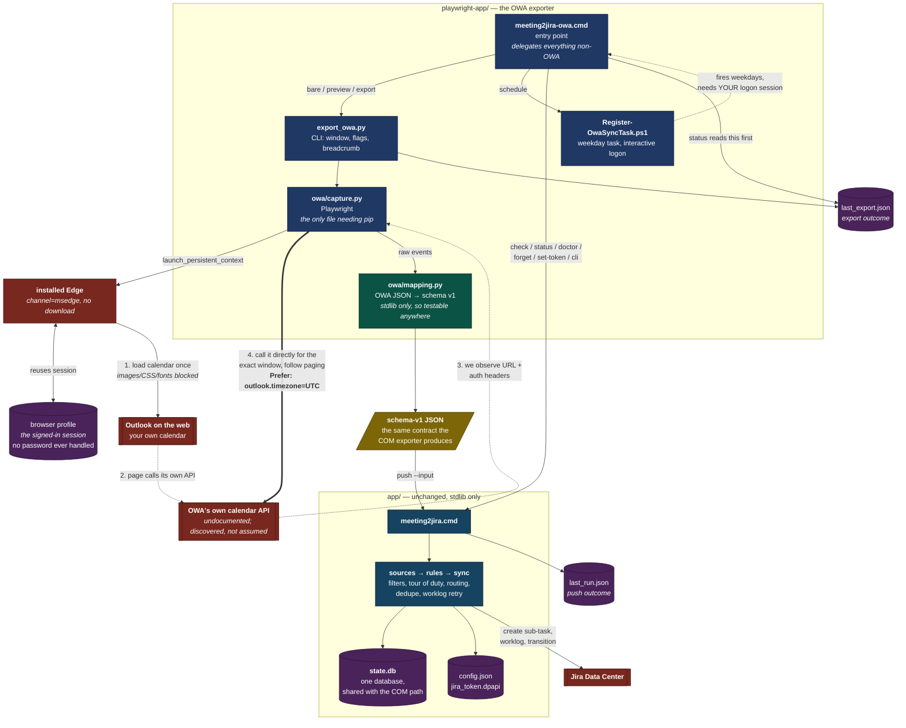

# How the OWA exporter works

For the design of the main tool see [../ARCHITECTURE.md](../ARCHITECTURE.md). This covers only what
is different: getting calendar data out of Outlook on the web instead of out of Outlook over COM.

One sentence: **the browser is used as an authenticated session, not as a screen to scrape.**

## The whole picture

The numbered path is the interesting part. Steps 1–3 happen once per run; step 4 is where the data
actually comes from, and it costs the same whether you ask for one day or thirty.

## Why observe-then-call, rather than scrape

The calendar grid is a virtualised React view. It renders only visible rows, its class names are
generated, and — the part that settles it — **the fields the filters depend on are not in the DOM**:
`responseStatus`, `sensitivity`, `categories`, and recurrence identity. A DOM scraper would silently
lose `skip_declined` and `skip_private`. For a tool whose job includes keeping private meetings out
of Jira, that is not an acceptable trade.

So the page is loaded once purely to watch it authenticate itself and ask its own API for events.
From that one observation we learn the URL and the auth headers, and then we ask the same endpoint
for the window we actually want.

## The four steps in detail

**1. Load the calendar once.** A persistent browser profile means the session from the last
interactive sign-in is reused, so no password is handled by this code and Conditional Access sees a
browser it already trusts. Images, CSS, fonts and media are aborted — the JSON arrives regardless.

**2–3. Observe.** A response listener waits for a request whose URL looks like a calendar read *and*
whose body actually contains events, matching on shape rather than trusting the URL. The URL and the
replayable auth headers are recorded. This blocks on the event rather than polling, so it returns the
instant the request lands.

**4. Call it directly.** The observed URL's date range is rewritten to our window, `$top` is raised to
reduce round trips, `Prefer: outlook.timezone="UTC"` is set so no timezone conversion is ever needed,
and `@odata.nextLink` is followed to the end. `context.request` shares the browser's cookies, so this
is authenticated without re-handling any credential.

## Performance, in the order it matters

| | |
|---|---|
| **Session reuse** | Removes interactive sign-in, the only genuinely slow step, and all MFA prompts. |
| **Installed Edge** | `channel="msedge"`, so no ~150MB browser download and no unsigned binary introduced. Falls back to bundled Chromium. |
| **Resource blocking** | Images, media, fonts, stylesheets aborted. Off during `--login`, or the sign-in page renders unstyled for the human. |
| **One render, then direct calls** | A 30-day export costs the same page load as a 1-day export. |
| **Event-driven waiting** | Blocks on the response event instead of polling, and slices the wait so a sign-in redirect is noticed promptly rather than after the full timeout. |
| **Headless** | Once a session exists. |

## What it inherits for free

Because the output is schema-v1 JSON and the pipeline is untouched, every correctness property
already paid for still applies: filters, tour of duty, routing rules, the per-run cap, ambiguous-create
recovery, bounded worklog retry, and private-subject withholding.

**One state database, shared.** `content_hash` is source-independent — normalised subject, start, end —
and `state.find()` matches on key *or* content hash. So a meeting already pushed via COM is recognised
here as `EXISTS`. Running both paths cannot double-create.

**Better Teams detection than COM.** `isOnlineMeeting` plus `onlineMeetingProvider` are explicit,
where the COM exporter has to match on the location string.

## Where it is fragile, and what that looks like

| Failure | How it surfaces | What to do |
|---|---|---|
| Browser session expired | Export fails; `_looks_like_sign_in` catches the redirect | `meeting2jira-owa login` |
| Microsoft changed the endpoint | "never saw a request returning events" | `meeting2jira-owa discover`, then `--endpoint` |
| Endpoint is a POST (`service.svc` shape) | Reported explicitly, then falls back to the events discovery already captured | Window is whatever the view showed; check `discover` for a GET-shaped endpoint |
| Endpoint ignored the UTC preference | `mapping.py` **refuses** rather than guessing an offset | Nothing silently shifts; fix the Prefer header |
| Playwright missing or broken | Recorded in `last_export.json` | `meeting2jira-owa setup` |

That fourth row is deliberate. Guessing a timezone offset would shift every meeting and look
plausible; Windows has no timezone database without the `tzdata` package, so the mapping refuses a
naive non-UTC time instead of converting it.

## The silent-failure hole this closes

The push writes `last_run.json`. But if the **export** fails, the push never runs, so `last_run.json`
keeps yesterday's success and `status` looks healthy while meetings quietly stop arriving — for days,
until the staleness warning notices.

So `export_owa.py` always writes `last_export.json`, on every path including "Playwright isn't
installed", and `meeting2jira-owa status` prints it *before* delegating to the main app's status.

## This is the fallback, not the destination

It depends on an undocumented Microsoft API that can change without notice. That is the price of not
having an app registration. If a Graph app registration ever comes through — public client, delegated
`Calendars.Read` — prefer it and retire this: same JSON contract, supported API, no browser.
